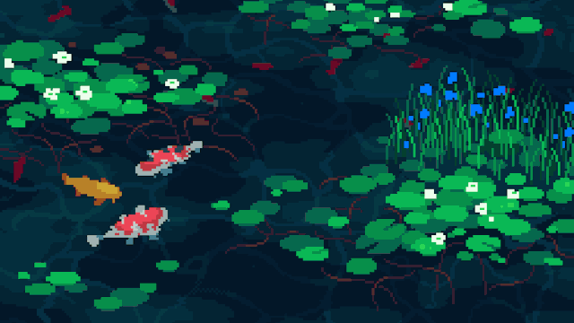
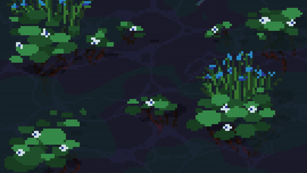

<br/>

<div align="center">

<!-- ─────────────────────────────────────────── -->
<!--                    HEADER                   -->
<!-- ─────────────────────────────────────────── -->

# `MAY · MAYCRODEV`

**`<`** SYSTEMS ENGINEER **`/`** AI DEVELOPER **`/`** BOLIVIA **`>`**

<br/>

[](https://maycrodev.github.io/portfolio)
[](https://workana.com)
[](https://linkedin.com/in/maycrodev)
[](mailto:cordeirojuanjose@gmail.com)

<br/>


</div>

<br/>

```ascii
╔══════════════════════════════════════════════════════════════════════╗
║                                                                      ║
║   $ whoami                                                           ║
║   > juan_jose_cordeiro · alias: MAY                                  ║
║   > systems_engineering @ universidad_católica_boliviana             ║
║   > status: available_for_remote_work                                ║
║                                                                      ║
╚══════════════════════════════════════════════════════════════════════╝
```

<br/>

## ▍ ABOUT

I'm **Juan José Cordeiro** — known online as **MAY**.
Final-year Systems Engineering student at **UCB · Bolivia**.

I build production-grade software across multiple domains: from **AI-powered bots** and **full-stack web systems** to **machine learning models** and **Roblox games** with procedural generation.

```diff
+ studying    →  systems engineering @ UCB · Bolivia
+ available   →  remote freelance projects · USD
+ focused on  →  AI automation & full-stack web
+ working w/  →  clients across LATAM, Spain & beyond
```

<br/>

## ▍ TECH STACK

<div align="center">

#### `LANGUAGES`


#### `FRAMEWORKS · LIBRARIES`


#### `PLATFORMS · TOOLS`


</div>

<br/>

## ▍ STATISTICS

<div align="center">

<a href="https://github.com/maycrodev">
  
</a>
<a href="https://github.com/maycrodev">
  
</a>

<br/><br/>

<a href="https://github.com/maycrodev">
  
</a>

</div>

<br/>

## ▍ ACTIVITY

<div align="center">

[](https://github.com/maycrodev)

</div>

<br/>

## ▍ TROPHIES

<div align="center">

[](https://github.com/maycrodev)

</div>

<br/>

## ▍ CONTACT

<div align="center">

```ascii
┌────────────────────────────────────────────────┐
│  $ contact --status                            │
│  > location   :: La Paz, Bolivia · GMT-4       │
│  > currency   :: USD                           │
│  > mode       :: 100% remote                   │
│  > response   :: < 24h                         │
└────────────────────────────────────────────────┘
```

<br/>

[](mailto:cordeirojuanjose@gmail.com)

</div>

<br/>



<div align="center">

`< crafted by MAY · 2026 />`

</div>
